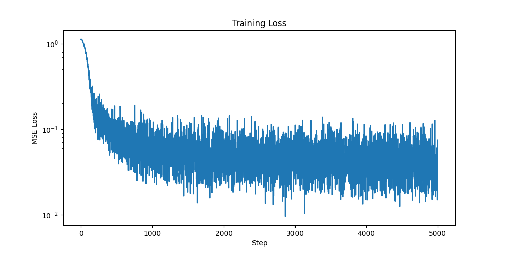
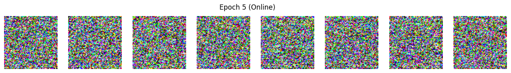
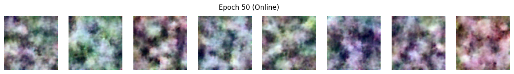
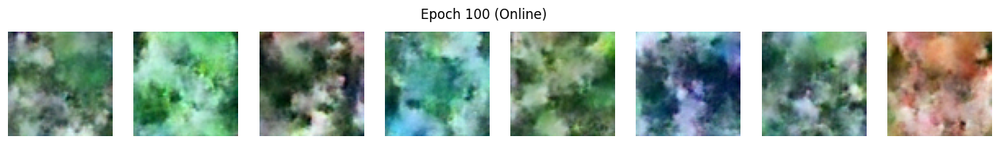
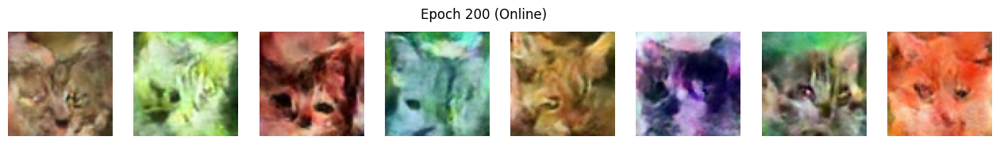
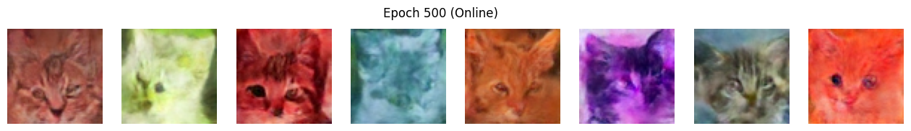

# Обучение диффузионной модели на датасете котов

Автор: Коновалов Валентин Русланович

## Выбранный датасет
Я выбрал датесет с котами из задания: [huggan/few-shot-cat](https://huggingface.co/datasets/huggan/few-shot-cat)
- Количество изображений: 160
- Предобработка: resize до 64x64

В ноутбуке `view_images.ipynb` есть их обработка из исходного файла и визуализация примеров.

Кроме того, поскольку картинок в датаесете очень мало, я применял следующие аугментации "на лету":
RandomCrop, RandomHorizontalFlip, ColorJitter. Тензоры, полученные из картинок, нормализуются в диапазон [-1, 1].

## Архитектура модели

Модель UNet2D (`diffusers.UNet2DModel`)

Конфигурация (скопирована из `config.py`):

```json
{
        "sample_size": 64,
        "in_channels": 3,
        "out_channels": 3,
        "layers_per_block": 1,
        "block_out_channels": (64, 128, 128, 256),
        "down_block_types": (
            "DownBlock2D",
            "DownBlock2D",
            "AttnDownBlock2D",
            "DownBlock2D",
        ),
        "up_block_types": (
            "UpBlock2D",
            "AttnUpBlock2D",
            "UpBlock2D",
            "UpBlock2D",
        )
    }
```

Тут всё довольно прозрачно, разве что можно отметить, что "layers_per_block": 1 обеспечивает наличие одного блока ResNetBlock2D внутри каждого этапа сжатия и расширения.

А пространственный размер на каждом блоке уменьшается(или увеличивается) в два раза: 64×64 -> 32×32 -> 16×16 -> 8×8 -> 4×4 -> 8×8 -> 16×16 -> 32×32 -> 64×64

## Как запустить

### Установка зависимостей

```bash
pip install -r requirements.txt
```

### Обучение

```bash
python train.py --dataset extracted_images --epochs 500 --batch_size 16 --image_size 64 --output_dir output
```

Параметры:
- `--dataset` — путь к папке с изображениями
- `--epochs` — количество эпох (по умолчанию 500)
- `--batch_size` — размер батча (по умолчанию 16)
- `--image_size` — размер изображений (по умолчанию 64)
- `--lr` — learning rate (по умолчанию 1e-4)
- `--output_dir` — директория для результатов

### Генерация (DDPM)

```bash
python sample.py --checkpoint output/final_model --method ddpm --steps 1000 --num_images 16
```

### Генерация (DDIM)

```bash
python sample.py --checkpoint output/final_model --method ddim --steps 100 --eta 0.0 --num_images 16
```

Параметры sample.py:
- `--checkpoint` — путь к директории с сохранённой моделью (обязательный)
- `--method` — метод сэмплинга: `ddpm`, `ddim` (по умолчанию ddpm)
- `--steps` — количество шагов инференса (по умолчанию: 1000 для DDPM, 100 для DDIM)
- `--num_images` — количество генерируемых изображений (по умолчанию 16)
- `--eta` — параметр стохастичности DDIM: 0 = детерминированный (по умолчанию 0.0)
- `--seed` — random seed для воспроизводимости (по умолчанию 42)
- `--output_dir` — директория для сохранения результатов (по умолчанию samples)

## Детали обучения

| Параметр              | Значение                            |
|-----------------------|-------------------------------------|
| Разрешение            | 64×64                               |
| Количество шагов шума | 1000                                |
| Batch size            | 16                                  |
| Эпохи                 | 500                                 |
| Learning rate         | 1×10⁻⁴                              |
| Оптимизатор           | AdamW (β₁=0.95, β₂=0.999)           |

Обучение осуществлялось на чипе Apple M2 Pro с использованием MPS. Общее время обучения составило примерно 5 часов.

## Результаты

### График Loss



Несмотря на то, что лосс начиная с 1000 шага был довольно нестабилен, по сгенерированным примерам видно, что качетво всё же скорее монотонно улучшалось. 

### Прогресс обучения

Чекпоинты я сохрянял, но на github загружать их не стал, так как они много весят.

Также в ходе обучения сохранялись сгенерированные изображения через каждые 5 эпох. Они доступны в папке `output`

| Эпоха | Сгенерированные изображения                |
|-------|--------------------------------------------|
| 5     |    |
| 50    |   |
| 100   |  |
| 200   |  |
| 500   |  |

### Сравнение DDPM и DDIM

| DDPM                                       |                   DDIM                              |
|--------------------------------------------|-------------------------------------------------|
| 50 шагов      | 10 шагов    |
| 200 шагов    | 50 шагов    |
| 500 шагов    | 100 шагов  |
| 1000 шагов  | 200 шагов  |

Выводы по примерам:

- ddim не нужно много шагов, после 50 качество даже скорее ухудшается
- у ddpm же качество заметно растёт с увеличением числа шагов, как и должно быть
- наилучшие картинки получаются у ddpm при тысяче шагов

### Время генерации

Привелённые ниже значения были получены путём усреднения по восьми сгенерированным картинкам

| Метод | Число шагов | Время, с | Время на шаг, мс |
|-------|-------------|----------|------------------|
| DDPM  | 1000        | 6.68     | 6.68             |
| DDIM  | 50          | 0.36     | 7.20             |
| DDIM  | 100         | 0.69     | 6.90             |

Видим, что время на один шаг везде примерно одинаковое, а общее время генерации соответственно пропорционально числу шагов. Очевидно, DDIM оказывается быстрее.

## Выводы

За пять часов на собственном макбуке получилось обучить диффузионную модель для генерации картинок котов размером 64×64. Обучение проводилось на 160 исходных изображениях в 500 эпох. Далее на инференсе DDIM из-за меньшего числа шагов отработал сильно быстрее, но его результат несколько уступает по качеству DDPM. В целом, качество полученных изображений я считаю вполне приемлемым, на них явно вырисовываются коты, что с учётом не самых больших ресурсов на обучение, вполне неплохой результат.

## Демо
Яндекс диск: https://disk.yandex.ru/i/0BYaBUddZFyfUw
